## Bitgo wallet configuration

1. Login to your bitgo account
2. Click in create wallet button
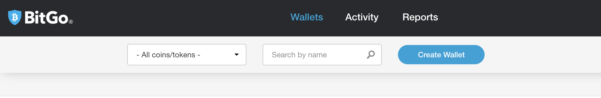
3. Choose wallet for appropriate currency
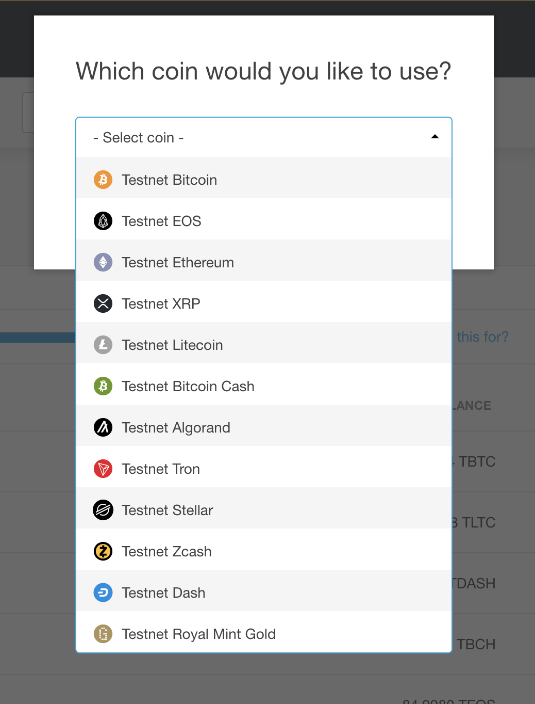
4. Setup your wallet
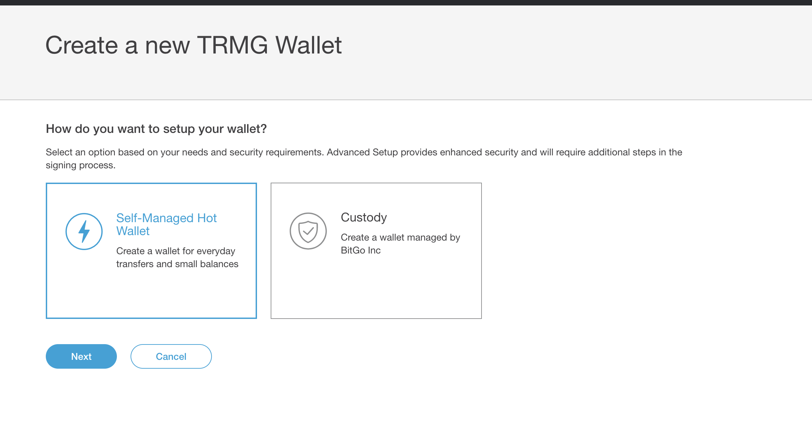
5. Put name of your wallet
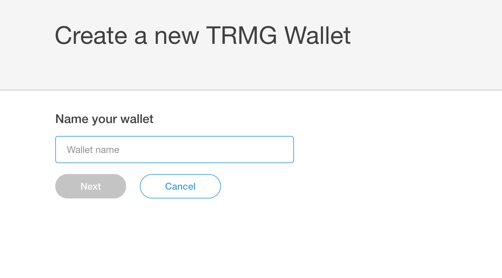
6. Put password of your wallet
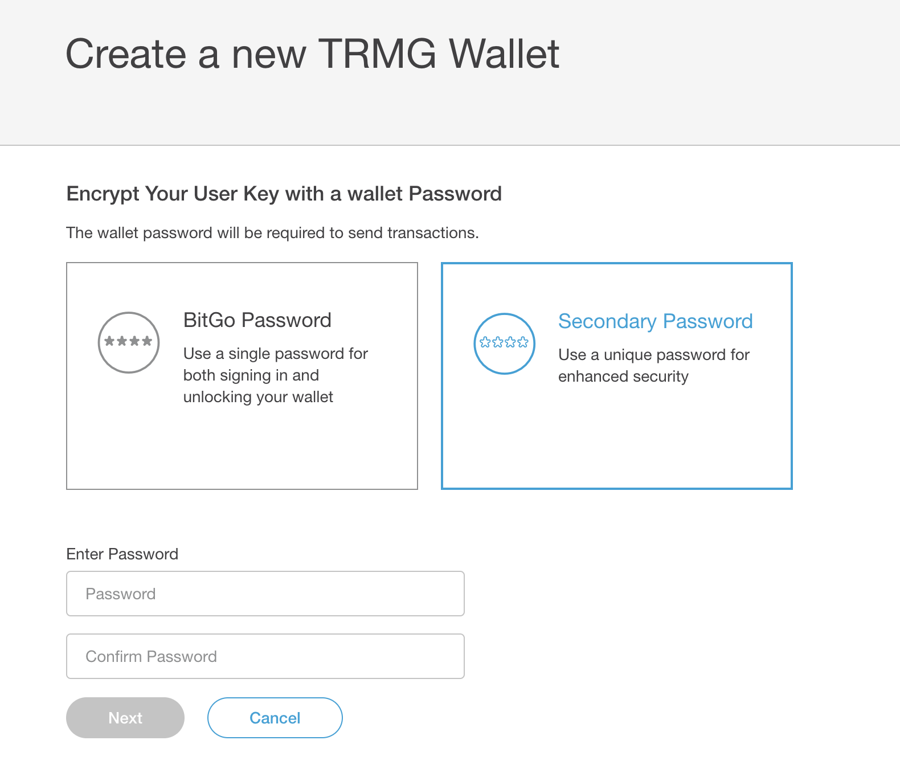
P.S. You should save this password for future wallet configuration

## Peatio BITGO wallet configuration

1. Go to tower admin panel Settings -> Wallets -> Add wallet
* Uri == Bitgo service URI
* Secret == Wallet password
* Bitgo Wallet Id
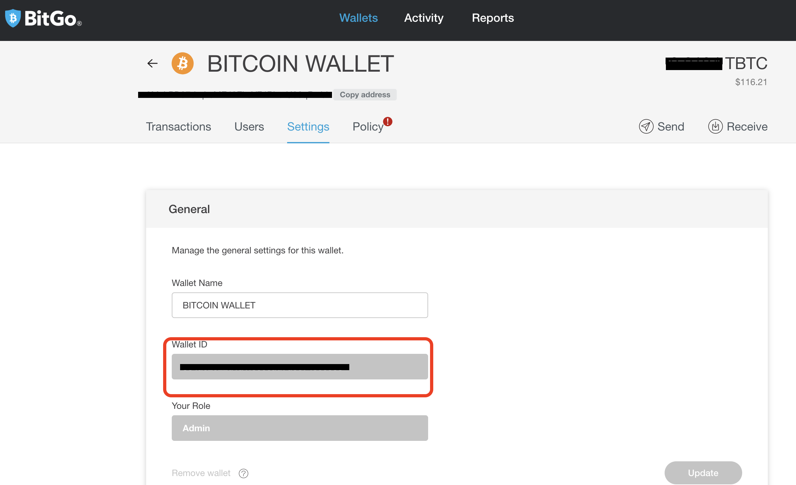
* Bitgo Access Token
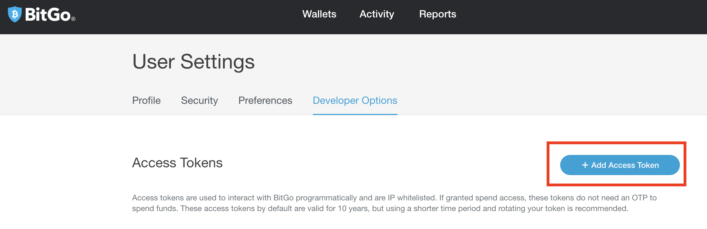
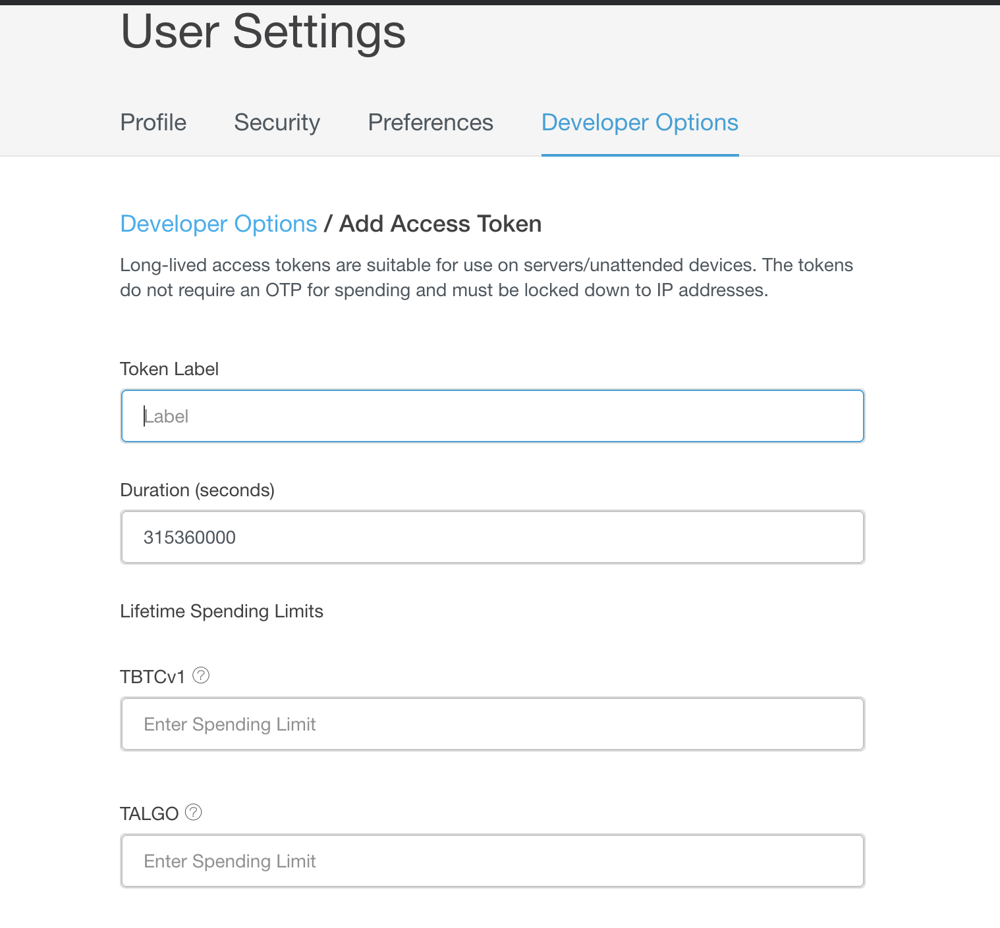
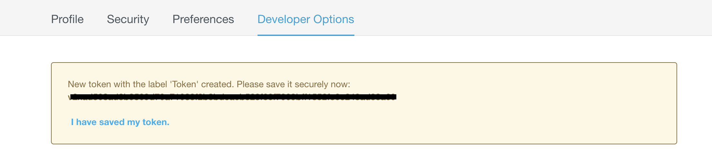

## Webhook configuration

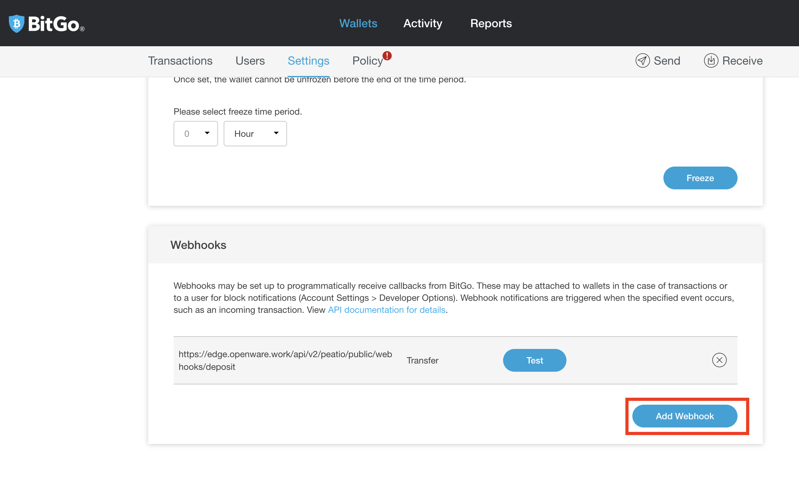
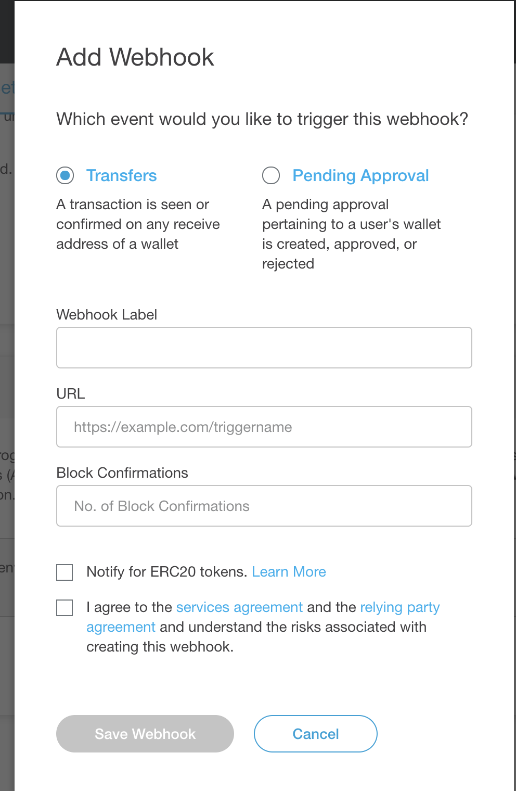

Where url should be "https://{host_url}/api/v2/peatio/public/webhooks/{event}"

* For deposit wallets event should be 'deposit'
* For hot wallets event should be 'withdraw'